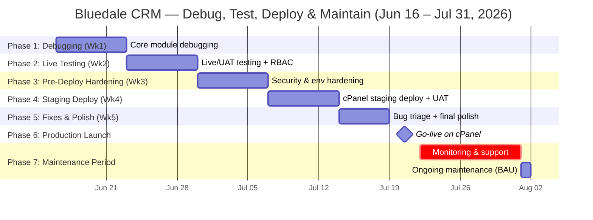

# Development Timeline — Bluedale CRM (library_crm_v2)

**Window:** 2026-06-16 → 2026-07-31 (and ongoing after)
**Mandate:** Supervisor approved 1–2 weeks of debugging + live testing before the production cPanel push, plus a maintenance window once it's live.

> Draft — adjust phase boundaries, task lists, or dates as needed.

---

## Visual Gantt (Mermaid)

> Note: the chart's hard deadline is Jul 31, but **Phase 7 (Maintenance)** is the start of an ongoing responsibility — it doesn't truly "end" on that date. The last bar is just a marker showing it continues into business-as-usual support beyond this chart's window.

---

## Weekly Breakdown

| Phase | Week | Dates | Focus | Key Tasks |
|---|---|---|---|---|
| **1. Debugging** | Wk 1 | Jun 16 – Jun 22 | Core stability | Re-test Contacts/Deals/Projects/Auth flows; fix known issues (e.g. MariaDB Aria table corruption); clear console/network errors across all 25+ pages |
| **2. Live Testing** | Wk 2 | Jun 23 – Jun 29 | Real-data UAT | Run app with real staff using it day-to-day; verify RBAC per role (admin/user/viewer); stress-test Performance, Reminders, WhatsApp webhook; log every bug found |
| **3. Pre-Deploy Hardening** | Wk 3 | Jun 30 – Jul 6 | Checklist items | Work through `Pre-Deployment Checklist` in `CLAUDE.md`: `APP_DEBUG=false`, mail service swap (Brevo/SendGrid), `SESSION_ENCRYPT`, queue worker plan, rotate exposed Gmail app password |
| **4. Staging Deploy** | Wk 4 | Jul 7 – Jul 13 | Dry-run on cPanel | Follow `cPanel Deployment Guide`: document root, DB port 3306, `.env` setup, `composer install --no-dev`, run migrations on a **staging** DB, smoke-test every module |
| **5. Fixes & Polish** | Wk 5 | Jul 14 – Jul 18 | Stabilize | Fix everything surfaced in staging; re-run regression pass on auth, notifications, exports; confirm `npm run build` output matches staging |
| **6. Production Launch** | Wk 6 (early) | Jul 19 – Jul 21 | Go-live | Final production `.env`, `migrate --force`, seed roles/permissions, `config:cache`/`route:cache`/`view:cache`, AutoSSL, first super-admin login, set `admin_notification_email` |
| **7. Maintenance Period** | Wk 6–7 | Jul 22 – Jul 31 (and ongoing) | Look after live system | Daily log/error monitoring; verify `queue:work` cron is running on schedule; watch DB performance on cPanel MySQL (port 3306); confirm scheduled backups exist; triage and hotfix any user-reported bugs; weekly check-in with supervisor on system health |

### Maintenance Period — detail
Since this phase has no natural end date, treat it as the start of standing operational duties rather than a one-off task:

- [ ] **Daily (first 2 weeks post-launch):** check Laravel logs (`storage/logs/laravel.log`) and queue cron output for errors
- [ ] **Daily:** confirm `* * * * * php artisan queue:work --stop-when-empty` cron is actually firing (no backlog)
- [ ] **Weekly:** review System Settings → admin notification email is delivering (password resets, first-login/inactivity alerts)
- [ ] **Weekly:** spot-check DB size/performance on cPanel MySQL; confirm host's automatic backups are enabled (or set up your own `mysqldump` cron if not)
- [ ] **As needed:** hotfix production bugs — branch off `main`, fix, redeploy built `public/build/` assets, re-run `config:cache`/`route:cache` if `.env` changed
- [ ] **Ongoing:** keep a running changelog of post-launch fixes for the supervisor handoff

---

## Open Questions for You
- Is "live testing" Week 2 with real staff, or a smaller pilot group?
- Should Week 6 (go-live) be a hard date, or does it flex if Week 5 testing finds blockers?
- Any features still in progress (per the CRM Feature Audit — partial/missing items) that need to land *before* go-live, or is this purely a stabilize-and-ship pass on what exists today?
- For the maintenance period: is this just you keeping watch, or do you need to formally hand off support duties to someone else after Jul 31?
